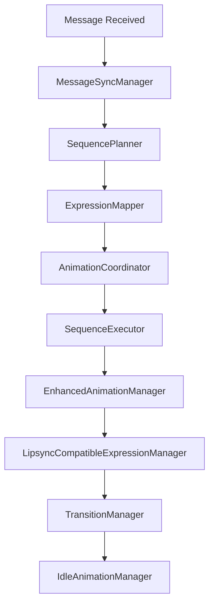

Tôi sẽ phân tích các file trong thư mục `intelligence/` để giải thích mục đích của từng file và hệ thống tổng thể.

[3 tools called]

## Mục đích của các file trong thư mục `intelligence/`

Thư mục `intelligence/` chứa một **hệ thống AI hoàn chỉnh** để tạo ra **Digital Humans** có khả năng tương tác tự nhiên và biểu cảm phong phú. Đây là kiến trúc phức tạp với các thành phần chuyên biệt:

### 🎯 **Core System Architecture**

#### 1. **MessageSyncManager.ts** - Trung tâm điều phối
- **Mục đích**: Quản lý toàn bộ lifecycle của message
- **Chức năng**: 
  - Nhận message → Lập kế hoạch → Thực thi → Cleanup
  - Đồng bộ hóa audio với animation
  - Quản lý state transitions
  - Xử lý lỗi và fallback

#### 2. **SequencePlanner.ts** - Lập kế hoạch thông minh
- **Mục đích**: Lập kế hoạch animation sequences dựa trên context
- **Chức năng**:
  - Phân tích emotional intent
  - Tính toán duration phù hợp với audio
  - Chọn strategy phù hợp (emotional, social, conversation)
  - Tối ưu hóa sequence

#### 3. **SequenceExecutor.ts** - Thực thi chính xác
- **Mục đích**: Thực thi animation sequences với timeline sync
- **Chức năng**:
  - Timeline management
  - Audio synchronization
  - Performance monitoring
  - Error handling

### 🎬 **Animation Management**

#### 4. **AnimationCoordinator.ts** - Chọn animation thông minh
- **Mục đích**: Chọn animation phù hợp dựa trên emotional intent
- **Chức năng**:
  - Priority-based animation selection
  - Context-aware animation mapping
  - Preloading và caching
  - Fallback strategies

#### 5. **AnimationLoader.ts** - Load và cache animations
- **Mục đích**: Quản lý loading và caching animation files
- **Chức năng**:
  - Load FBX animation files
  - Optimize animation clips
  - Cache management
  - Memory optimization

#### 6. **EnhancedAnimationManager.ts** - Quản lý animation mixer
- **Mục đích**: Quản lý Three.js AnimationMixer và sequences
- **Chức năng**:
  - Crossfading animations
  - Sequence execution
  - Audio synchronization
  - Performance monitoring

### �� **Expression Management**

#### 7. **ExpressionMapper.ts** - Map emotion thành expression
- **Mục đích**: Chuyển đổi emotional intent thành facial expressions
- **Chức năng**:
  - Emotion-to-expression mapping
  - Intensity-based selection
  - Contextual variants
  - Blending expressions

#### 8. **LipsyncCompatibleExpressionManager.ts** - Tương thích lipsync
- **Mục đích**: Quản lý expressions tương thích với lipsync
- **Chức năng**:
  - Tách biệt mouth và non-mouth morph targets
  - Đồng bộ với audio playback
  - Preserve expressions during speech
  - Restore full expressions after speech

#### 9. **TransitionManager.ts** - Quản lý transitions mượt mà
- **Mục đích**: Tạo transitions mượt mà giữa các expressions
- **Chức năng**:
  - Smooth blending between expressions
  - Easing functions
  - Priority-based transitions
  - Micro-expressions

### �� **Idle System**

#### 10. **IdleAnimationManager.ts** - Quản lý idle animations
- **Mục đích**: Tạo idle animations tự nhiên khi không có interaction
- **Chức năng**:
  - Random idle animations
  - Emotion-based idle states
  - Repetition prevention
  - Natural timing

## 🔄 **Workflow tổng thể**

## 🎯 **Mục đích tổng thể**

Hệ thống này tạo ra **Digital Humans** có khả năng:

1. **Phân tích emotional intent** từ text/audio
2. **Chọn animation phù hợp** dựa trên emotion và context
3. **Tạo facial expressions** tương ứng với emotion
4. **Đồng bộ hóa với audio** (lipsync) một cách tự nhiên
5. **Quản lý transitions** mượt mà giữa các states
6. **Xử lý idle animations** để tạo cảm giác sống động
7. **Tối ưu hóa performance** và memory usage

Đây là một **hệ thống AI tiên tiến** để tạo ra digital humans có khả năng tương tác tự nhiên, biểu cảm phong phú và đồng bộ hóa hoàn hảo với audio!